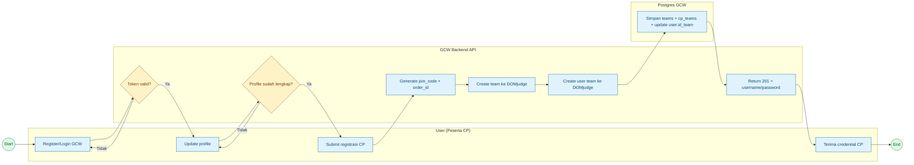
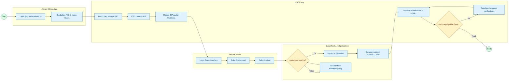
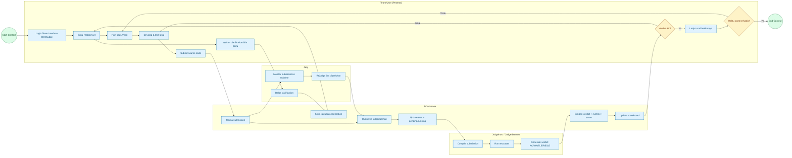

# DOMjudge Usage Guide (GCW Backend)

Dokumen ini merangkum langkah penggunaan DOMjudge untuk project GCW:
- Menjalankan DOMjudge via Docker Compose
- Menghubungkan DOMjudge ke Backend
- Menjalankan test via cURL (sesuai flow yang sudah dipakai)
- Membuat 1 akun administrator untuk PIC upload soal
- Setup sistem upload soal (Jury UI + API alternatif)
- User Activity Diagram (Mermaid) dari sisi user CP dan Jury/PIC
- Unit test checklist untuk submission & judging workflow + kesimpulan

Dokumen ini juga dipakai sebagai dokumentasi handover operasional Backend + DOMjudge.

## 1) Prasyarat

- Docker + Docker Compose
- Backend GCW sudah bisa jalan di `http://localhost:8000`
- Database Postgres backend aktif (sesuai `Backend/.env`)
- Tools bantu: `curl`, `jq` (opsional, tapi disarankan)

## 2) Menjalankan DOMjudge via Docker

File compose: `Backend/docker-compose.domjudge.yml`

Jalankan DB + domserver:

```bash
cd /Users/raqwan/Documents/GCW/Backend
docker compose -f docker-compose.domjudge.yml up -d domjudge-database domserver
```

Ambil password admin awal dan secret API judgehost:

```bash
docker exec domserver cat /opt/domjudge/domserver/etc/initial_admin_password.secret
docker exec domserver cat /opt/domjudge/domserver/etc/restapi.secret
```

Catatan penting:
- `initial_admin_password.secret` -> dipakai login user `admin`
- `restapi.secret` -> dipakai user `judgehost` (bukan admin)

Sinkronkan password judgehost di compose (service `judgehost`):

```yaml
JUDGEDAEMON_PASSWORD=<password_dari_restapi.secret>
```

Lalu recreate judgehost:

```bash
docker compose -f docker-compose.domjudge.yml up -d --force-recreate judgehost
```

Validasi judgehost:

```bash
docker logs --tail=200 judgehost
```

## 3) Konfigurasi Backend ke DOMjudge

Set `Backend/.env`:

```env
DOMJUDGE_URL=http://localhost:1234
DOMJUDGE_CONTEST_ID=1
DOMJUDGE_USERNAME=admin
DOMJUDGE_PASSWORD=<ADMIN_PASSWORD>
```

Catatan:
- Kode backend hanya membaca `DOMJUDGE_USERNAME` dan `DOMJUDGE_PASSWORD`.
- Jangan isi dengan user `judgehost`, karena akan kena error:
  `Access Denied by controller annotation @IsGranted("ROLE_API_WRITER")`

Restart backend setelah update `.env`.

## 4) Smoke Test via cURL (Flow yang Dipakai)

### 4.1 Cek API DOMjudge pakai admin

```bash
curl -i -u admin:'<ADMIN_PASSWORD>' http://localhost:1234/api/v4/contests
```

Ekspektasi: `HTTP/1.1 200 OK`

### 4.2 Login/Register user GCW dan ambil token

Jika user belum ada:

```bash
curl -s -X POST http://localhost:8000/api/v1/gcw/resources/auth/registration \
  -H "Content-Type: application/json" \
  -d '{"name":"Tes User","email":"tescp@example.com","password":"password123"}'
```

Jika user sudah ada, login:

```bash
LOGIN=$(curl -s -X POST http://localhost:8000/api/v1/gcw/resources/auth/login \
  -H "Content-Type: application/json" \
  -d '{"email":"tescp@example.com","password":"password123"}')

TOKEN=$(printf '%s' "$LOGIN" | jq -r '.Data.access_token')
echo "$TOKEN"
```

### 4.3 Update profile (wajib untuk lewat middleware)

```bash
curl -i -s -X POST http://localhost:8000/api/v1/gcw/resources/profile/my \
  -H "Authorization: Bearer $TOKEN" \
  -H "Content-Type: application/json" \
  -d '{"name":"Tes User","gender":"L","nim":"12345678","birth_place":"Jakarta","birth_date":"2000-01-01","institusi":"UG","phone":"0812","major":"Informatika"}'
```

Ekspektasi: `HTTP/1.1 200 OK` dan `profile_has_updated: true`

### 4.4 Registrasi tim CP (trigger create team/user di DOMjudge)

```bash
curl -i -s -X POST http://localhost:8000/api/v1/gcw/resources/team/registration/cp \
  -H "Authorization: Bearer $TOKEN" \
  -H "Content-Type: application/json" \
  -d '{"team_name":"Tim CP Test","supervisor":"Dosen A","supervisor_nidn":"1234567890","join_code":"654321","bukti_pembayaran":"-"}'
```

Ekspektasi: `HTTP/1.1 201 Created`, response berisi:
- `domjudge_username`
- `domjudge_password`
- `join_code` (gunakan nilai dari response sebagai source of truth)

### 4.5 Cek detail akun CP berdasarkan join code hasil response

```bash
curl -s http://localhost:8000/api/v1/gcw/resources/cp/<JOIN_CODE_HASIL_RESPONSE>
```

### 4.6 Validasi di DOMjudge Jury

- Buka `http://localhost:1234/jury`
- Cek menu `Teams` -> tim baru harus muncul
- Cek menu `Users` -> user team baru harus muncul

## 5) Membuat 1 Akun Administrator untuk PIC Upload Soal

1. Login ke `http://localhost:1234/jury` sebagai `admin`
2. Buka menu `Users`
3. Klik tambah user
4. Isi:
   - Username: `pic_soal` (contoh)
   - Name: `PIC Upload Soal`
   - Password: password kuat
5. Role:
   - Jika butuh akses penuh: pilih role admin/administrator
   - Jika hanya operasional kontes: pertimbangkan role jury (lebih aman)
6. Save, lalu login ulang dengan akun PIC untuk verifikasi

Untuk upload soal:
- Menu `Problems` -> import/upload package soal
- Menu `Contests` -> attach soal ke contest yang aktif

## 6) Setup Sistem Upload Soal

Bagian ini fokus untuk workflow PIC saat mengelola soal.

### 6.1 Metode yang direkomendasikan (Jury UI)

1. Login ke `http://localhost:1234/jury` dengan akun PIC (`pic_soal`).
2. Pastikan contest target sudah ada dan aktif (`Contests`).
3. Siapkan arsip soal per file ZIP dengan format ICPC problem package.
4. Buka menu `Problems`.
5. Pilih contest target.
6. Pada field `Problem archive(s)`, pilih file ZIP soal.
7. Klik `Upload`.
8. Ulangi untuk setiap soal.

Verifikasi:
- Soal muncul di daftar `Problems`
- Label (A/B/C/...) terpasang
- Soal terlihat di `Problemset` untuk contest yang dipilih

### 6.2 Metode API (opsional untuk otomasi)

Contoh alur dari dokumentasi DOMjudge:

1. Import metadata problem (opsional, jika belum ada):

```bash
http --check-status -b -f POST "http://localhost:1234/api/v4/contests/<CID>/problems/add-data" data@problems.yaml -a admin:<ADMIN_PASSWORD>
```

2. Upload ZIP problem:

```bash
http --check-status -b -f POST "http://localhost:1234/api/v4/contests/<CID>/problems" zip@problem.zip problem="<PROBID>" -a admin:<ADMIN_PASSWORD>
```

Keterangan:
- `<CID>`: contest ID
- `<PROBID>`: problem ID (mis. `hello`, `sum`)

### 6.3 Smoke test upload soal

Setelah upload berhasil:
- Login sebagai akun team (atau akun CP hasil provisioning dari backend)
- Submit solusi contoh ke soal yang baru di-upload
- Pastikan submission masuk di menu `submissions` (jury)
- Pastikan status judging keluar (AC/WA/TLE/dll)

## 7) User Activity Diagram (Mermaid)

### 7.1 Flow User Registrasi Competitive Programming



### 7.2 Flow Jury/PIC Operasional



### 7.3 Flow Kompetisi (User Team Saat Contest Berjalan)



## 8) Unit Test Checklist: Submission, Upload Soal & Judging Workflow

Semua test di bawah sudah dibuat sebagai unit test backend dan sudah dijalankan.

Perintah run:

```bash
cd /Users/raqwan/Documents/GCW/Backend
GOCACHE=$(pwd)/.gocache go test ./tests -v -count=1
```

Ringkasan hasil run terakhir: semua test `PASS`.

| Test ID | Skenario | Nama Unit Test | Status |
|---|---|---|---|
| UT-SUB-001 | Submission workflow create + get status | `TestUTSUB001_CreateAndGetSubmissionWorkflow` | PASS |
| UT-SUB-002 | Reject submission saat join code tidak valid | `TestUTSUB002_CreateSubmission_InvalidJoinCode` | PASS |
| UT-SUB-003 | CP registration + provisioning credential DOMjudge | `TestUTSUB003_CPRegistrationProvisioning` | PASS |
| UT-SUB-004 | Ambil credential CP by join code | `TestUTSUB004_CPCredentialRetrieval` | PASS |
| UT-UPL-002 | Kontrak API provisioning team+user ke DOMjudge | `TestUTUPL002_DomjudgeCreateTeamAndUser_RequestContract` | PASS |
| UT-UPL-003 | Validasi error credential DOMjudge tidak valid | `TestUTUPL003_DomjudgeCreateTeam_InvalidCredential` | PASS |
| UT-UPL-004 | Simulasi submit solusi sample tercatat di storage backend | `TestUTUPL004_SubmitSampleSolutionRecorded` | PASS |
| UT-UPL-005 | Simulasi hasil judging mengubah stage CP | `TestUTUPL005_JudgingResultGenerated` | PASS |
| UT-JDG-001 | Validasi auth header API DOMjudge | `TestUTJDG001_DomjudgeAPIAuthHeader` | PASS |
| UT-JDG-002 | Update CP stage + update team name tersimpan | `TestUTJDG002_UpdateCpStageWorkflow` | PASS |

Catatan:
- Unit test di `service` tidak bergantung pada container `judgehost`, jadi bisa dipakai untuk verifikasi logic backend meskipun judgedaemon sedang bermasalah.
- Uji UI manual (login akun PIC, upload ZIP di menu `Problems`, cek `Problemset`) tetap direkomendasikan untuk acceptance test operasional.

## 9) Kesimpulan

Integrasi DOMjudge pada Backend GCW sudah berjalan dengan baik dengan syarat:
- `DOMJUDGE_USERNAME/PASSWORD` memakai akun admin DOMjudge
- password `judgehost` disinkronkan dari `restapi.secret`
- user GCW wajib update profile dulu sebelum registrasi tim CP

Hasil uji unit backend menunjukkan alur submission, provisioning credential DOMjudge, dan update workflow judging sudah tervalidasi `PASS`. Selain itu ada perbaikan di service dashboard agar perubahan `team_name` pada update CP/Hackathon benar-benar tersimpan ke tabel `teams`.

---

## Troubleshooting Cepat

- `invalid token` saat hit API backend:
  - pastikan header hanya `Authorization: Bearer <access_token>`
  - jangan gabungkan `refresh_token` ke header

- `Access Denied ... ROLE_API_WRITER`:
  - backend masih pakai credential `judgehost`
  - ganti ke admin di `DOMJUDGE_USERNAME/PASSWORD`

- `user already registered`:
  - gunakan endpoint login, bukan registration

## 10) Referensi Resmi

- DOMjudge Manual 8.2 - Import/Export (contest data & problem upload): `https://www.domjudge.org/docs/manual/8.2/import.html`
- DOMjudge Documentation Portal: `https://www.domjudge.org/documentation`
